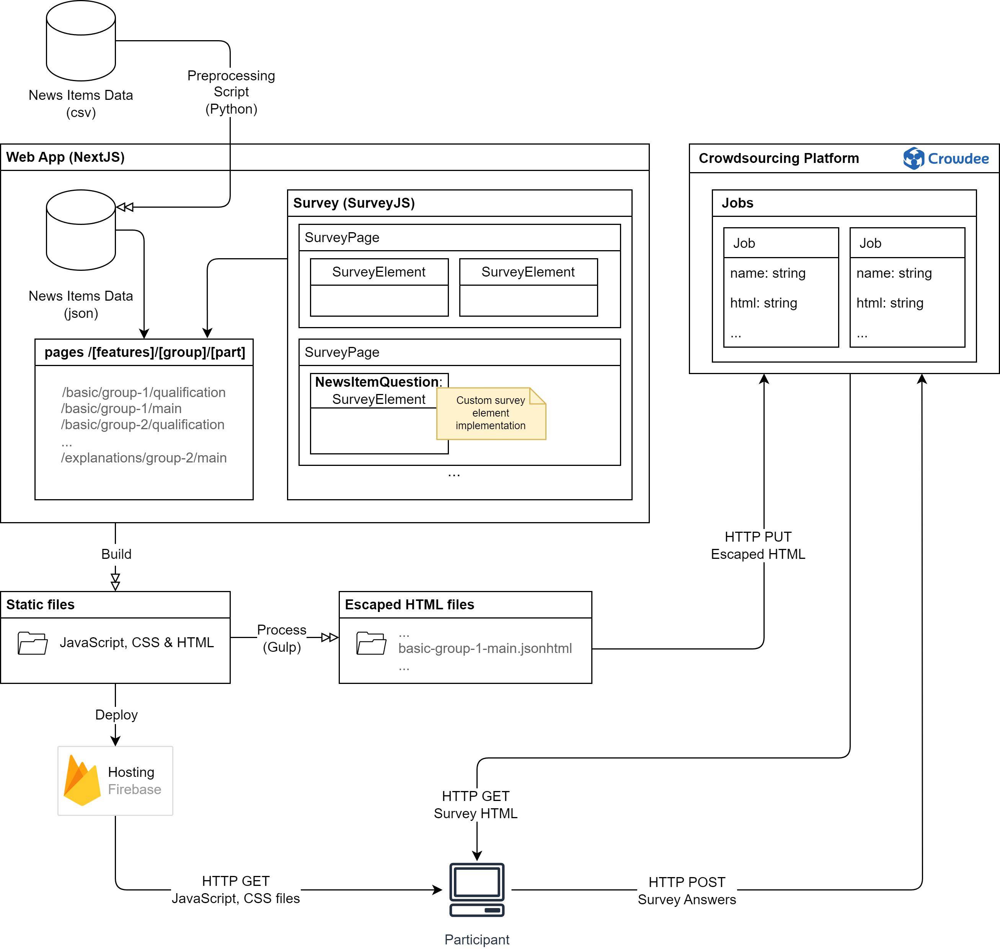

# Evaluation of Explainability Features in the Fake News Detection Context

### Built With

- [Next.js](https://nextjs.org/docs)
- [React](https://react.dev/learn)
- [SurveyJS](https://surveyjs.io/documentation)
- [Material UI](https://mui.com/material-ui/getting-started/overview/)

- ### Citation

If you find this toolkit or its companion paper "Evaluating Human-Centered AI Explanations: Introduction of an XAI Evaluation Framework for Fact-Checking" interesting or useful in your research, use the following Bibtex annotation to cite us:

@inproceedings{schmitt_mad,
    author = {Schmitt, Vera and Csomor, Balazs and Meyer, Joachim and Villa-Arenas, Luis-Felipe and Jakob, Charlott and Polzehl, Tim and Möller, Sebastian},
    title = {Evaluating Human-Centered AI Explanations: Introduction of an XAI Evaluation Framework for Fact-Checking},
    year = {2024},
    isbn = {979-8-4007-05526},
    publisher = {Association for Computing Machinery},
    address = {New York, NY, USA},
    url = {https://doi.org/10.1145/3643491.3660283},
    doi = {10.1145/3643491.3660283},
    location = {Phuket, Thailand},
    series = {MAD '24}
    }

## Web App implementation

## Metrics

- Performance
- Perceived Usefulness of xAI features
- Perceived Understandability of xAI features
- Trust in the AI system 

## Data Cleaning and Analysis

See the [Data_Cleaning_XAI.ipynb](./data-analysis/Data_Cleaning_XAI.ipynb) notebook for data cleaning and the [Data_Analysis_XAI.ipynb](./data-analysis/Data_Analysis_XAI.ipynb) notebook for data analysis. Raw survey data is available in the [data-analysis/data/raw](./data-analysis/data/raw) folder and news items can be found in the [news-items.csv](./preprocessing/news-items.csv) file.
